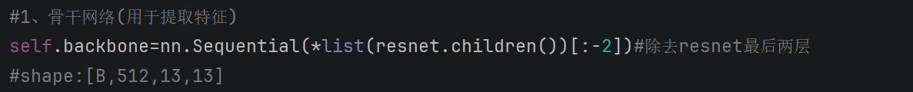
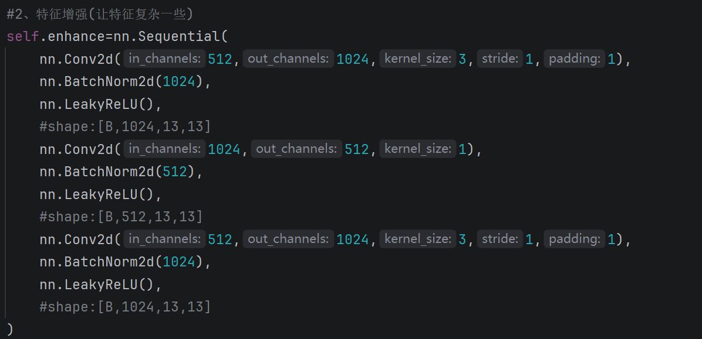

## ————GridAnchorDetector(CNN+锚框预测)————

### ——项目简介——

        一个从零实现的多目标检测器，采用了YOLOv2风格的锚框预测思想。

### ——模型信息——

--输入：[Batch_size, 3, 416, 416]

--输出：[Batch_size, 13, 13, 5, 5+nc]，其中nc为数据集类别数

--锚框数：5（对所有目标框采用kmeans聚类得到）

--结构：

1、特征提取模块：采用ResNet18的特征提取层（无预训练）。

2、特征增强模块：采用Conv+BN+LeakyReLU的叠加来增强特征。

3、特征处理模块：降维，拟合输出格式。

4、前向传播函数：

### ——性能结果——

--测试数据集：CST数据集

--评估指标：平均精度均值mAP@0.5，预测准确率acc

--数据增强：无

--额外优化：早停机制（加速训练）、yaml配置文件（快速修改数据集和超参数）

--训练轮次：100

--损失函数：

①位置损失(MSELoss)：仅正样本；

②置信度损失(MSELoss)：lambda_obj×正样本损失+lambda_noobj×负样本损失；

③类别损失(CrossEntropyLoss)：仅正样本；

④**总损失**=lambda_lct_loss×位置损失+lambda_conf_loss×置信度损失+lambda_cls_loss×类别损失；

--优化器：Adam（lr=0.001）

--**最佳mAP：0.9564**（测试集）

--**最佳acc：0.998958**（测试集）

### ——预测示例——

--此示例存放于detect目录下：

